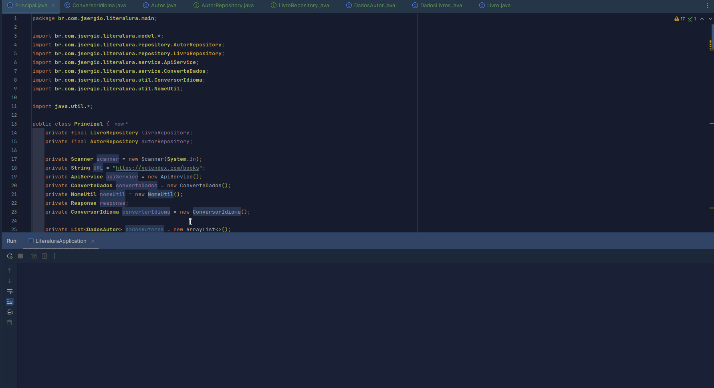

# PROJETO-LiterAlura

## Descrição

---

Esse projeto faz parte da trilha de aprendizado proposta pela Alur em parceria com a Oracle. O Objetivo é criar um
programa que busca e salva as informações de livros e seus autores em um banco de dados.

## Objetivos de aprendizado

---

- Aprender a utilizar o JDBC para se conectar a um banco de dados
- Aprender a utilizar o Maven para gerenciar as dependências do projeto
- Aprender a utilizar o JPA para mapear as entidades do banco de dados
- Aprender a utilizar o Hibernate para persistir as entidades no banco de dados

## Tecnologias utilizadas

---

- Java 17
- Maven
- JDBC
- JPA
- Spring

## Dependências

---

- PostgreSQL
- Docker

## Demo

## Como rodar o projeto

---

Para rodar o projeto basta
clonar o repositório e executar o projeto em um IDE 
que suporte Java 17.
O banco de dados precisa ser criado manualmente, as
tabelas são criadas automaticamente.

## Autor
- José Sergio Pinto da silva

Linkedin: [José Sergio Pinto da Silva](www.linkedin.com/in/josésérgiopsilva)

